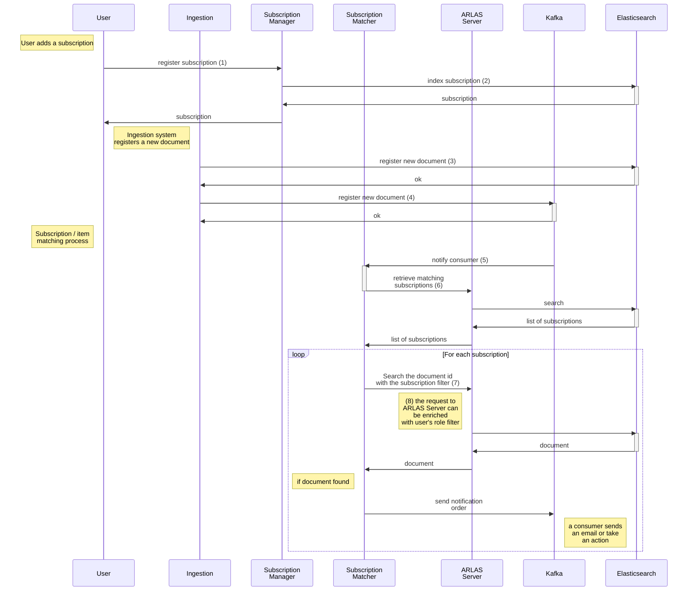

## Subscription Mechanism

### What for?
The aim of the ARLAS Subscription services is to automatically notify users of new document availability based on a filter contained in a user defined subscription.

For instance, a user can subscribe to pictures taken around the Tour Eiffel (see Flickr on http://cloud.arlas.io). When pictures are referenced in elasticsearch/kafka, then the subscription system identifies the __roughly matching__ subscriptions and then makes a final document search based on the user defined filter to make sure the user can access the data. If so, a notification is sent to kafka. It is then up to you to decide what to do with the notification, like sending an email or triggering an action.

### Components

The main components are:

- Ingestion system (not provided): Registers documents in ES, notifies new availability in kafka
- User or API Client (not provided): subscribes to document of interest new availability
- Subscription manager: http microservice to add/remove/list subscriptions
- Subscription: notified of new products, identify matching subscriptions, send notifications.
- Kafka: queue for event notifications and notification orders
elasticsearch: indices containing products and subscriptions
- ARLAS Server: Data access for products and subscriptions

### Sequence

A user [creates a subscription](api/reference.md#register-a-new-subscription) (1). It contains three parts:

   - subscription properties (id, active, user_id, etc) with a geographic trigger
   - a filter:
      - a user defined filter
      - a projection (fields of the product to add in the notification)
   - user metadatas: generic object that is transmitted in the notification order

Subscriptions are persisted in mongodb and indexed in ES

The subscription matcher has a configurable ARLAS filter expression (`arlas-subscriptions-subscriptionFilterRoot`) that is used for identifying relevant subscriptions that are matching the event properties, with event values injected in the expression. The default expression also contains constraints like `active:eq:true`, `deleted:eq:false` and `expires_at:gt:now`
 
The system adds a new product in Elasticsearch (3) and then pushes a message in kafka (4). As soon as an event in kafka is received, the subscription matcher is notified (5) and retrieves the subscriptions from ARLAS using the mentioned ARLAS filter expression (6). Then, for each subscription, the filter part of the subscription is used combined to the configurable filter `arlas-server-hitFilterRoot`. By default it contains the essential constraint `id:eq:(object.id)`. This combined filter is used to retrieve the product from ARLAS (8). Note that the user identity is in the header of the retrieval request, so that a proxy can enrich the request with partition filters (7). If the product is retrieved, this means that the product matches precisely the user defined filter. Note that arlas-server-hitFilterRoot can be used to defined further constraints so that only a subset of the products can be “notifiables”. Also, if a proxy is used between ARLAS Matcher and ARLAS Server, then user role based filters can be added with the partition filter.

If the product is retrieved given a subscription (9), then a notification order is pushed on kafka (10). It contains 
the data resulting from the search with the projection
the id of the subscription
a callback if configured
the user metadata node from the subscription

